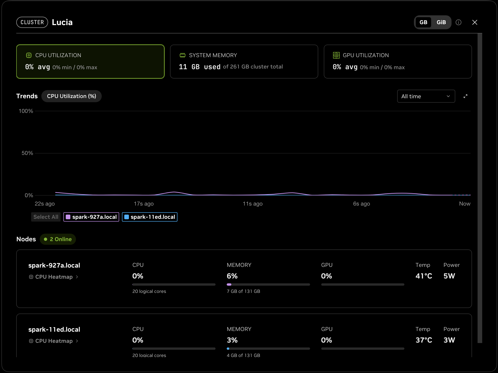
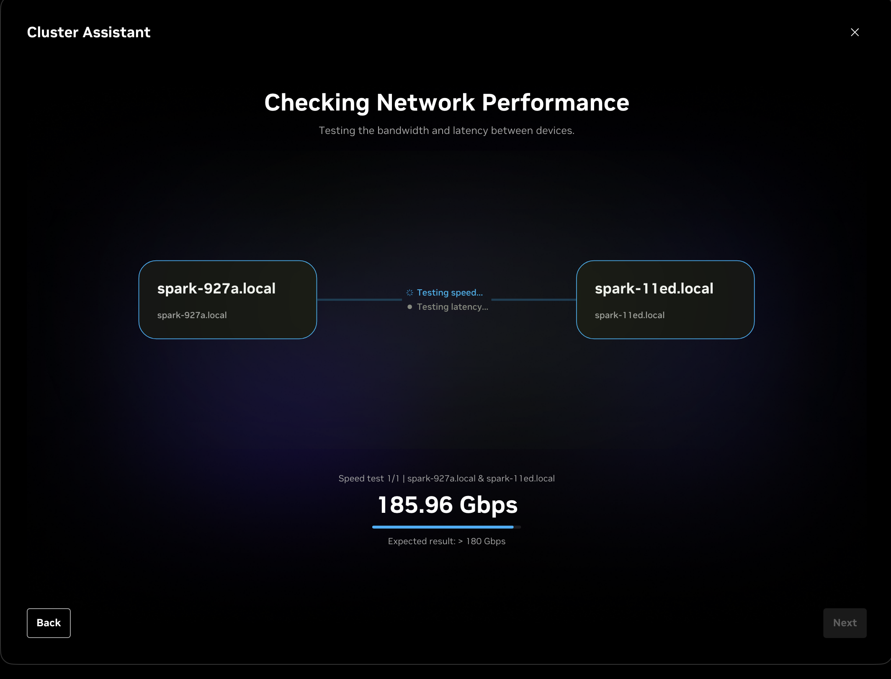

# ⚡ SparkBench — Benchmarks and Fine-Tuning Studies on the NVIDIA DGX Spark

[](https://docs.nvidia.com/dgx/dgx-spark/)
[](https://build.nvidia.com/spark/vllm)
[](https://mlflow.org/)
[](https://dvc.org/)
[](LICENSE)
[](#build-plan)

**Benchmarks and fine-tuning studies on the NVIDIA DGX Spark. Not that Spark.**

SparkBench is the umbrella repo for everything I measure on two NVIDIA DGX Sparks (GB10, 128 GB unified memory each, linked over the built-in ConnectX-7 200 GbE ports), in two chapters: [`bench/`](bench/) — a reproducible inference benchmarking suite (throughput, latency, memory across models and quantization levels) — and [`experiments/01-finetune-vs-frontier/`](experiments/01-finetune-vs-frontier/) — the flagship study: **can a LoRA fine-tuned 7–14B open model, running locally, replace the frontier model inside [AgentReview](https://github.com/vondraysanford/agent-review)'s Quality Agent at comparable precision/recall and near-zero marginal cost per review?**

This is the third leg of a deliberate portfolio arc: [DocQuery](https://github.com/vondraysanford/docquery) proved RAG works in the .NET ecosystem, AgentReview proved multi-agent orchestration does too, and SparkBench asks whether the most expensive component in that stack — the frontier LLM call — can be replaced with a model I trained myself, on hardware I own.

> **🚧 Status: Phase 0 — scope lock.** Building in public, ~7 working weekends, September → mid-November 2026. Nothing below is claimed as done unless its box is checked, and every number in the results table must trace to an MLflow run ID. The two Sparks are already bridged (Sep 6, 2026, via NVIDIA Sync's Cluster Assistant, link measured at 185.96 Gbps) — see [`infra/cluster.md`](infra/cluster.md).

**The checkboxes in this README are an honesty contract. No box gets checked until its phase's exit test passes — and every exit test is binary. It passed or it didn't.**



*Cluster `Lucia`: `spark-927a` and `spark-11ed` bridged over ConnectX-7, as NVIDIA Sync sees them. Idle for now.*

---

## Why This Project

Fine-tuning tutorials end at a loss curve. The hard, employable skill is the whole loop: building a contamination-proof eval set, manufacturing training data in the exact inference format, iterating inside a fixed budget, and reporting results with confidence intervals against a real production baseline — then shipping the model behind the same interface the frontier model occupied.

SparkBench runs that loop against a system I already built and measured. AgentReview's Quality Agent has published numbers (17/18 planted-bug recall, 100% human-judged precision, $0.068/review with a frontier model). That makes it a rare thing: a personal project with a genuine production baseline to beat.

**The experiment cannot fail — it can only conclude differently.** All three outcomes are pre-registered and all three are publishable:

- **Headline A:** "The fine-tuned 8B matched the frontier model — my code reviews now cost $0 marginal."
- **Headline B:** "Fine-tuning closed X points of the gap — here's exactly what it bought and what it didn't."
- **Headline C:** "The untuned small model was already good enough — you don't need fine-tuning, you need a harness."

The table decides which headline ships. Not me.

---

## The Experiment

One component varies: the LLM call inside AgentReview's Quality Agent. Everything else — the Roslyn static-analysis pass, the merge/synthesis code, the findings JSON schema, the seeded PRs, the decoding settings — is frozen at one git-tagged harness commit for the duration.

| Held constant (all conditions) | Varies (the conditions) |
|---|---|
| Roslyn static analysis pass | **A:** Frontier model, prompted (current AgentReview) |
| Deterministic merge/synthesis code | **B:** Small model, prompted, untuned, served by vLLM |
| Findings JSON schema | **C:** Small model, LoRA fine-tuned, merged, served by vLLM |
| Seeded PRs and planted bugs | **C-q (optional):** C, quantized to FP8 or NVFP4 with NVIDIA Model Optimizer, served by vLLM |
| Temperature/decoding settings | **D (optional, pre-registered):** ~70B-class open model, untuned, served by vLLM across both Sparks (tensor parallel 2) |
| Harness version (git-tagged) | |
| Serving engine: vLLM, one pinned NGC container tag | |

The local model drops in behind the same provider interface the agent already calls — the identical swap pattern DocQuery was built around. Because vLLM exposes an OpenAI-compatible endpoint, every local condition is the same provider with a different base URL and model name.

```
                 AgentReview harness (frozen @ tagged commit)
                                  │
              Roslyn pass ──► Quality Agent ──► findings JSON ──► scoring
                                  │
                        ┌─────────┴─────────┐
                        │  swappable LLM    │   ◄── the ONLY thing that varies
                        └─────────┬─────────┘
          ┌───────────────────────┼───────────────────────┐
          ▼                       ▼                       ▼
   A. Frontier API        B. Small model,          C. Small model,
      (baseline)             untuned                 LoRA fine-tuned
                                  │                       │
                                  └──────────┬────────────┘
                                             ▼
                              ┌───────────────────────────┐
                              │ Spark 1 · train           │  NGC PyTorch container
                              │ Spark 2 · serve + eval    │  NGC vLLM container
                              │ ConnectX-7 QSFP 200 GbE   │  D: TP=2 across both
                              └───────────────────────────┘
```

Condition D exists to answer a question the second Spark makes askable: on this exact hardware, does fine-tuning an 8B beat simply running a much larger untuned model? It is pre-registered now so it cannot be added after the fact, and it is the first thing cut if the schedule slips.

### Master Results Table (fills in as phases complete — every cell traceable to an MLflow run ID)

| Condition | Eval-18 recall | Eval-18 precision | v2-TEST recall (95% CI) | v2-TEST precision (95% CI) | Schema-valid % | Latency/review | $/review |
|---|---|---|---|---|---|---|---|
| A. Frontier, prompted | — | — | — | — | — | — | — |
| B. Small, untuned | — | — | — | — | — | — | — |
| C. Small, fine-tuned | — | — | — | — | — | — | — |
| C-q. Fine-tuned, quantized (vLLM FP8/NVFP4) | — | — | — | — | — | — | — |
| D. Large, untuned (vLLM TP=2, optional) | — | — | — | — | — | — | — |

**Statistical honesty rules, set before any data exists:** Eval-18 (n=18, AgentReview's legacy benchmark) reports raw counts only — "16/18," never "88.9%," never a significance claim. v2-TEST (n≈40+, built in Phase 3) reports bootstrap 95% confidence intervals; if intervals overlap heavily, the writeup says so. Cost is reported three ways — frontier API price, local *marginal* (measured watts × my $/kWh), and local *amortized* (hardware ÷ 3-year straight line) — because "free" without a footnote is a lie. Amortized cost counts only the Spark(s) a condition actually ran on: one unit for B, C, and C-q; both units for D.

### The Rules (frozen at Phase 0, never renegotiated)

- **One-touch test sets:** Eval-18 and v2-TEST are run against the fine-tune exactly once, in Phase 6. All iteration happens on v2-DEV.
- **Iteration budget:** maximum 5 full training runs. Budgets force decisions; unlimited retries force overfitting.
- **Schema-failure policy:** an unparseable response scores as zero findings *and* increments a separately-tracked failure counter. No manual rescues, ever.
- **Contamination firewall:** eval repos excluded from training data at the repo level, then exact-hash and near-duplicate scans, with the check outputs published in the dataset card.
- **One template:** the training-example format and the inference format are the same file, imported by both pipelines. Format drift between train and serve is the #1 silent killer of fine-tunes.
- **One serving engine:** every local condition (B, C, C-q, D) is served by vLLM from one pinned NGC container tag. The artifact that gets evaluated is the artifact that gets served — merged bf16 weights for C, the quantized checkpoint for C-q. No engine swaps between conditions, so engine differences can never masquerade as model differences.

---

## Tech Stack

**Training** (Spark 1)
- Hugging Face `transformers` + `peft` + `trl` (SFTTrainer) inside the NGC PyTorch container, following NVIDIA's [Fine-Tune with PyTorch](https://build.nvidia.com/spark/pytorch-fine-tune) playbook — first candidate stack; NVIDIA's [Unsloth](https://build.nvidia.com/spark/unsloth) and [NeMo AutoModel](https://build.nvidia.com/spark/nemo-fine-tune) playbooks are the fallbacks evaluated in the Phase 1 smoke test, winner logged with reasons
- LoRA (r=16, α=32, bf16, sequence packing) — QLoRA only if memory or wall-time forces it
- Base model: a 7–14B open-weights code-capable model. Selection rule: prefer a family that appears in NVIDIA's [vLLM-on-Spark model support matrix](https://github.com/NVIDIA/dgx-spark-playbooks/blob/main/nvidia/vllm/README.md#model-support-matrix) with published FP8 and NVFP4 variants (Qwen3-8B/14B and Llama 3.1 8B qualify today), so the quantized path is already validated on this GPU. Final picks logged in the experiment card.

**Serving** (Spark 2)
- vLLM from the NGC container (`nvcr.io/nvidia/vllm`, tag pinned in the experiment card), following NVIDIA's [vLLM for Inference](https://build.nvidia.com/spark/vllm) playbook — OpenAI-compatible endpoint for every local condition
- Quantization for C-q: FP8 first, NVFP4 second, produced with NVIDIA Model Optimizer per the [NVFP4 Quantization](https://build.nvidia.com/spark/nvfp4-quantization) playbook, served by the same vLLM container. You evaluate what you serve.
- Two-node serving for D: Ray-backed tensor parallelism across both Sparks, exactly as the vLLM playbook's "Run on two Sparks" section describes

**Rigor & Tracking**
- MLflow — one experiment for the whole project, one run per training/eval execution (the same discipline as [DriftWatch](https://github.com/vondraysanford/drift-watch))
- DVC — dataset versioning; every training corpus revision recorded in the dataset card
- OpenTelemetry — latency and token counts, via AgentReview's existing instrumentation

**Harness**
- [AgentReview](https://github.com/vondraysanford/agent-review) (C#/.NET) at a git-tagged commit — the production system under test

**Hardware**
- 2× NVIDIA DGX Spark — each a GB10 Grace Blackwell superchip: 20-core Arm CPU, Blackwell GPU, 128 GB LPDDR5x unified memory at 273 GB/s, ConnectX-7 NIC with two QSFP ports ([hardware spec](https://docs.nvidia.com/dgx/dgx-spark/hardware.html)). The ARM + Blackwell quirks are part of the story.
- Roles: **Spark 1 trains, Spark 2 serves and evaluates.** Training runs and DEV evals overlap instead of queueing. The two are already cabled QSFP-to-QSFP per NVIDIA's [Spark Stacking](https://docs.nvidia.com/dgx/dgx-spark/spark-clustering.html) guide and bridged with NVIDIA Sync's Cluster Assistant (cluster `Lucia`, 2026-09-06, 185.96 Gbps measured) — hostnames, addresses, and what's still to validate are in [`infra/cluster.md`](infra/cluster.md). The link itself is only needed for condition D and the dual-node benchmarks.
- What the link is and isn't: 200 Gb/s between nodes versus 273 GB/s to local memory. Two Sparks give 256 GB of addressable memory for one model, not a 2× faster single model. Every dual-node claim in `bench/` is measured, never assumed.

---

## Build Plan

~7 working weekends, September → mid-November 2026. Hard gate between phases: Phase N+1 does not start until Phase N's binary exit test passes. Evidence (screenshots, numbers, GIFs) is captured the session it first appears, into `evidence/phase-N/`; session notes accumulate in [`BUILDLOG.md`](BUILDLOG.md) and become the blog posts.

### Phase 0 — Scope Lock & the Experiment Card

- [ ] Repo scaffolded: `bench/`, `experiments/01-finetune-vs-frontier/`, `infra/`, DVC + MLflow initialized
- [ ] AgentReview harness commit git-tagged — the frozen baseline for every condition
- [ ] Two candidate base models picked and justified in the experiment card, checked against NVIDIA's vLLM-on-Spark support matrix
- [ ] NGC container tags pinned for vLLM and PyTorch and recorded in `infra/containers.md` — one serving image for the whole experiment
- [ ] `experiment-card.md`: hypothesis, conditions (including whether C-q and D are in scope, and D's exact model and precision), metrics contract, three pre-registered headlines, 5-run budget, and the pre-registered success margin for the fine-tune

**Exit test:** a stranger reading the experiment card can answer — without asking me — what is being compared, on what data, by what metrics, and what each of the three outcomes looks like.

### Phase 1 — Training Environment Smoke Test on the Sparks

- [ ] Training stack stood up on Spark 1 inside the NGC PyTorch container per NVIDIA's [PyTorch fine-tuning playbook](https://build.nvidia.com/spark/pytorch-fine-tune); winner and war stories logged
- [ ] vLLM NGC container serving the untuned base model on Spark 2 per the [vLLM playbook](https://build.nvidia.com/spark/vllm); one chat completion round-trips
- [ ] ~100 toy examples hand-written in the exact inference chat format; 50–100 step LoRA smoke train
- [ ] Full loop proven: train on Spark 1 → save adapter → reload → merge → copy to Spark 2 → serve via vLLM → one schema-valid findings JSON back
- [ ] Measured tok/s projects a full training run (~3k examples × 2–3 epochs) at under 12 hours — overnight-able
- [ ] *Non-gating — **completed 2026-09-06 ahead of order**, box follows the Phase 1 gate per the contract:* both Sparks bridged with NVIDIA Sync's Cluster Assistant — access, user, and GB10 checks passed, CX-7 network created, link validated at **185.96 Gbps** (threshold > 180). Screenshots in [`evidence/phase-1/`](experiments/01-finetune-vs-frontier/evidence/phase-1/), facts in [`infra/cluster.md`](infra/cluster.md).
- [ ] *Non-gating:* NCCL `all_gather_perf` and RDMA `ib_write_bw` numbers recorded in `bench/results/` per NVIDIA's [NCCL playbook](https://build.nvidia.com/spark/nccl) and performance guide — the first `bench/` entries

**Exit test:** loss curve decreases in MLflow, the served fine-tune returns schema-valid JSON, and a full run fits overnight. If not: drop to the 7B or switch to QLoRA and re-smoke. The cluster link is not part of the gate — nothing on the critical path needs it until Phase 6.

### Phase 2 — Baseline the Untuned Small Model

- [ ] Local model wired in behind AgentReview's provider interface as an OpenAI-compatible endpoint pointed at vLLM on Spark 2; harness untouched
- [ ] Condition A (frontier) re-run fresh at the tagged commit — published numbers re-confirmed
- [ ] Condition B (small, untuned) run on Eval-18 after one honest day of prompt effort, then frozen
- [ ] Master table rows A and B complete for Eval-18, with latency and cost from OTel

**Exit test:** two complete, traceable table rows before any fine-tuning exists. Without row B, the fine-tune can't prove it did anything. *Kill-criteria checkpoint: if B already matches A, Headline C becomes the story — noted in the BUILDLOG that day, not retroactively.*

### Phase 3 — Eval Set v2: Plant, Verify, Freeze

- [ ] Planting protocol doc written *before* any bugs are planted
- [ ] ~60 bugs planted across ~25 PRs in fresh, permissively-licensed C# repos (plus genuinely clean PRs as false-positive bait) — every bug human-verified
- [ ] Split at the PR level: v2-DEV (~20 bugs, iteration) / v2-TEST (~40 bugs, one-touch)
- [ ] Eval set git-tagged, fixtures hashed, lineage documented; conditions A and B run once on both splits with bootstrap CIs

**Exit test:** v2 is frozen and replicable from the protocol doc alone; rows A and B are complete for all v2 columns.

### Phase 4 — The Training Data Factory

- [ ] ~2,000–3,000 examples from two sources: synthetic bug injection (ground truth for free) + frontier distillation on organic diffs — all in the exact inference format
- [ ] ~25–35% clean diffs whose correct output is an empty findings list — a model trained only on bugs learns every diff must contain one
- [ ] Decontamination: repo-level exclusion, exact-hash and MinHash scans against both eval sets, results saved
- [ ] 25-example manual audit ≥90% clean; dataset DVC-versioned with a full `dataset-card.md`

**Exit test:** dataset card complete, zero eval overlap, audit passed, revision recorded.

### Phase 5 — Train and Iterate (DEV only)

- [ ] Run 1: boring-on-purpose config (LoRA r=16, α=32, lr 1–2e-4 cosine, 2–3 epochs, bf16)
- [ ] Iterate within the 5-run budget — one knob per run, in leverage order: data mix, epochs, learning rate, rank
- [ ] Every run: merge → serve on Spark 2 → full v2-DEV eval + schema validity, logged to MLflow with config as params. Run N+1 trains on Spark 1 while run N evaluates on Spark 2.
- [ ] If C-q is in scope: quantize the current best once mid-phase with NVIDIA Model Optimizer (FP8 first, NVFP4 if time) and eval the quantized artifact through the same vLLM container

**Exit test (passes on either branch):** best checkpoint beats row B on v2-DEV by the pre-registered margin at ≥95% schema validity → Headline A/B track; *or* the budget is exhausted, the best checkpoint is frozen anyway, and the gap gets one honest paragraph → Headline B. The gate enforces discipline, not a result — both branches ship.

### Phase 6 — Final Evaluation: One Pass, Then Freeze

- [ ] Winning checkpoint tagged; each condition run exactly once on Eval-18 and v2-TEST
- [ ] If D is in scope: both Sparks joined as a Ray cluster per the vLLM playbook, the pre-registered large model served with tensor parallel 2, run exactly once on both splits
- [ ] Master table 100% complete — bootstrap CIs on v2-TEST, raw counts on Eval-18, every cell footnoted with its run ID
- [ ] **Per-miss autopsy:** one honest paragraph for every false negative and false positive from the fine-tune
- [ ] The headline the table actually supports selected; side-by-side GIF recorded (same PR, frontier vs. my fine-tune)

**Exit test:** the money table, produced once, defensible forever.

### Phase 7 — Ship Everything

- [ ] Repo public; experiment README opens with the master table and a "reproduce the eval in 30 minutes" section
- [ ] Adapter + model card on Hugging Face (license permitting), with the results table and an honest limitations section
- [ ] `bench/` chapter filled with months of real training/serving throughput, memory, and latency numbers as reproducible scripts, using the `vllm bench` methodology from NVIDIA's [DGX Spark performance guide](https://github.com/NVIDIA/dgx-spark-playbooks/blob/main/nvidia/connect-two-sparks/assets/performance_benchmarking_guide.md) — single-Spark and dual-Spark sections
- [ ] Three posts assembled from the BUILDLOG: data + decontamination, training-on-Spark war stories, and the results post
- [ ] *Stretch:* a frontier-vs-fine-tune model toggle on the AgentReview live demo

**Exit test:** the stranger test — a clean machine reproduces the headline eval from the README in under 30 minutes without contacting me.

---

## Repository Layout (target)

```
sparkbench/
├── bench/                                # Chapter 1: inference benchmarks on the Sparks
│   ├── scripts/
│   │   ├── single-spark/                 #   vllm bench throughput/serve, per model × precision
│   │   └── dual-spark/                   #   NCCL + RDMA link tests, TP=2 vs TP=1 serving
│   └── results/                          #   measured numbers, per model × quantization × nodes
├── infra/                                # what the two machines run
│   ├── containers.md                     #   pinned NGC tags (vLLM, PyTorch) + why
│   ├── cluster.md                        #   QSFP cabling, interface names, IPs, env vars
│   └── serve/                            #   vllm serve launch scripts per condition
├── experiments/
│   └── 01-finetune-vs-frontier/          # Chapter 2: the flagship study
│       ├── experiment-card.md            #   hypothesis, conditions, metrics, headlines
│       ├── dataset-card.md               #   sources, licenses, contamination checks, audit
│       ├── data/                         #   DVC-versioned training corpus
│       ├── training/                     #   LoRA configs + run scripts
│       ├── quantize/                     #   Model Optimizer recipes for C-q
│       ├── eval/                         #   Eval-18 + v2 fixtures, scoring, autopsies
│       └── evidence/phase-N/             #   dated screenshots, numbers, GIFs (raw/ gitignored)
├── tools/                                # capture tooling
│   ├── gif.sh                            #   screen recording → README GIF + social MP4 (ffmpeg)
│   ├── side-by-side.sh                   #   two recordings → one comparison GIF (Phase 6)
│   └── tapes/                            #   VHS tapes: scripted, re-renderable terminal demos
├── BUILDLOG.md                           # session-by-session: what worked, broke, surprised
└── README.md
```

## Building in Public

Every phase has a moment that is worth more as a picture than as a paragraph, and the guide's [capture calendar](SparkBench-Guide.md#11-evidence--content-capture) names them in advance so they get caught the first time they happen. The rule: **one shareable artifact per session** — a screenshot, a photo, or a 20-second clip — filed under `evidence/phase-N/` with the date in the filename, and one line in [`BUILDLOG.md`](BUILDLOG.md) saying which one is post-worthy.



*First capture: the Cluster Assistant's speed test between `spark-927a` and `spark-11ed`, Sep 6, 2026.*

What gets captured, by kind:
- **Photos** — the two Sparks stacked with the QSFP cable (the hero image, still owed), and the lab shot for the results post.
- **Screenshots** — NVIDIA Sync with both nodes busy (Spark 1 training, Spark 2 serving), MLflow loss curves and run comparisons, the first schema-valid JSON, the finished master table.
- **Clips and GIFs** — the smoke train's progress bar, vLLM booting, the side-by-side review (frontier vs. fine-tune), and the 30-minute reproduction as a scripted terminal tape.

Tooling lives in [`tools/`](tools/): `gif.sh` turns a screen recording into a README GIF plus a social MP4 using ffmpeg's two-pass palette, and `side-by-side.sh` stacks two recordings for the Phase 6 comparison. Terminal sessions are recorded with asciinema and rendered with agg; reproducible demos are VHS tapes.

## Official NVIDIA References

Everything hardware- and serving-related in this repo follows NVIDIA's published documentation first and community write-ups second. Playbooks are published at [build.nvidia.com/spark](https://build.nvidia.com/spark) with source in the Apache-2.0 [NVIDIA/dgx-spark-playbooks](https://github.com/NVIDIA/dgx-spark-playbooks) repo, which is updated often — re-check the week each phase starts.

| Topic | Official source |
|---|---|
| DGX Spark User Guide (setup, DGX OS, software, recovery) | [docs.nvidia.com/dgx/dgx-spark](https://docs.nvidia.com/dgx/dgx-spark/) |
| Hardware specification | [Hardware Overview](https://docs.nvidia.com/dgx/dgx-spark/hardware.html) |
| Connecting Sparks (topologies, approved QSFP cables, interface names) | [Spark Stacking](https://docs.nvidia.com/dgx/dgx-spark/spark-clustering.html) |
| Automated cluster setup and link validation | [NVIDIA Sync Cluster Assistant](https://docs.nvidia.com/sync/latest/cluster-assistant.html) |
| Two-node cabling, IPs, passwordless SSH | [Connect Two Sparks playbook](https://build.nvidia.com/spark/connect-two-sparks) |
| Multi-node collective bandwidth test | [NCCL playbook](https://build.nvidia.com/spark/nccl) |
| vLLM serving, single and two-node, model support matrix | [vLLM for Inference playbook](https://build.nvidia.com/spark/vllm) |
| vLLM NGC container and release notes | [nvcr.io/nvidia/vllm](https://catalog.ngc.nvidia.com/orgs/nvidia/containers/vllm) · [release notes](https://docs.nvidia.com/deeplearning/frameworks/vllm-release-notes/index.html) |
| PyTorch LoRA/QLoRA fine-tuning, single and two-node FSDP | [Fine-Tune with PyTorch playbook](https://build.nvidia.com/spark/pytorch-fine-tune) |
| Alternative training stacks | [Unsloth](https://build.nvidia.com/spark/unsloth) · [NeMo AutoModel](https://build.nvidia.com/spark/nemo-fine-tune) · [LLaMA Factory](https://build.nvidia.com/spark/llama-factory) |
| Quantizing to NVFP4 with NVIDIA Model Optimizer and serving with vLLM | [NVFP4 Quantization playbook](https://build.nvidia.com/spark/nvfp4-quantization) |
| Benchmark methodology (offline/online serving, fine-tuning, dual-Spark RDMA) | [DGX Spark performance guide](https://github.com/NVIDIA/dgx-spark-playbooks/blob/main/nvidia/connect-two-sparks/assets/performance_benchmarking_guide.md) |
| Speculative decoding on Spark | [Speculative Decoding playbook](https://build.nvidia.com/spark/speculative-decoding) |
| Support and known issues from other owners | [DGX Spark developer forum](https://forums.developer.nvidia.com/c/accelerated-computing/dgx-spark-gb10) |

## Related

- **[AgentReview](https://github.com/vondraysanford/agent-review)** — the multi-agent code-review system whose Quality Agent this experiment targets; source of the frozen harness and the baseline numbers
- **[DocQuery](https://github.com/vondraysanford/docquery)** — origin of the swappable-provider pattern that makes the model swap a config change
- **[DriftWatch](https://github.com/vondraysanford/drift-watch)** — origin of the MLflow run-tracking discipline every number here inherits
- Build posts land at [vondraysanford.com](https://vondraysanford.com) as each phase ships

## Contributors

- **[Vondray Sanford](https://github.com/vondraysanford)** — spec, hardware, review, evidence captures, and benchmarks
- **[Shah Young](https://github.com/shah-young)** - networking, infrastructure, resource testing, local environment validation, QA (quality assurance) validation
Contributions are welcome. Fork the repo, make your change on a branch, run
`pytest`, and open a pull request. Keep to the project's constraints: no
database, no bundler, and about 800 lines excluding tests. SparkDash is
[MIT licensed](LICENSE), so anything you submit is released under the same
terms.
